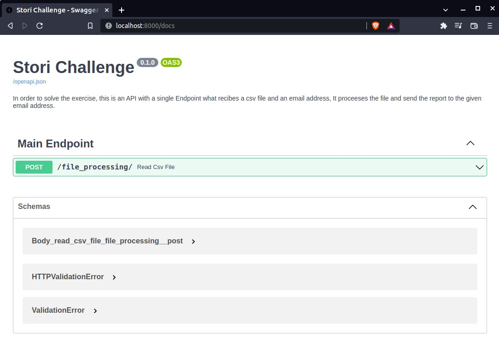
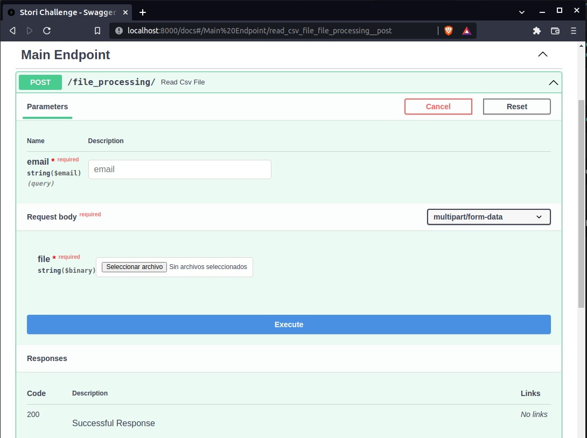
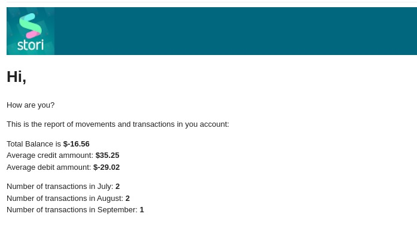

# Stori Home Challenge

## Erick Urias
email: erickuriasb@gmail.com

## Home Test for Python Engineer Position in Stori
  
An instance of this app, is running right now on AWS with the next url: [App Instance on AWS](http://18.144.176.65/docs), you can check it out and test it.
  
### Prerequisites:
* Docker
* Docker Compose

### Installation:

All the next commands are thinked for a development environment on a Linux Distribution or Mac, if you are using Windows maybe these steps could be a little different. In that case I recommend to use a terminal emulator like [Cmder](https://cmder.net/) or Powershell.  

1. First you need to clone this repo to your local machine, Use the HTTPS link.
```bash
git clone https://github.com/erickuriasb/stori-home-test.git
```
2. Setup the environment variables, the app need them to send the email report.
```bash
export OUTLOOK_USER="user"
export OUTLOOK_PASSWORD="password"
```
3. For this challenge, I used Outlook Mail to send the emails with the smtplib python module as email client. To send your own emails, you need to create a free account on [Outlook Mail](https://outlook.office.com/mail/) and use the credentials(user and password) as environment variables. If you would to use a Gmail account, since May 30th, Gmail doesn't permit access for 'insecure' email clients, It's a new privacy policy, that's why a choosed Outlook Mail.

4. Enter to the app folder, if you are using a Linux distribution or Mac type the next command (maybe you already knew this).   
```bash
cd stori-home-test
```
5. Run the next command in order to create the image, install all the dependecies and run the container:
```bash
docker-compose up -d
```

6. Go to your browser and type the next [url](http://localhost:8000/docs):
```
http://localhost:8000/docs
```
7. This is SWAGGER-UI, an Interactive API documentation that allow us directly to test the endpoint, or if you preffer, you could use another tool like [Postman](https://www.postman.com/) or [Insomnia](https://insomnia.rest/).  


8. You can expand the green area, click the "Try It Out" button, fill the fields and execute the endpoint. This endpoint uses the POST method to recieve the data, you must to use a valid and existing email address and a CSV file with a specific format. In this repo is included a file named "txcs.csv" , this file is an example that you can use to test the endpoint, you can use your own csv file, just make sure that uses the same data format.  


9. Once you click in the "Execute" button, if the email is validated correctly, and also the data file has the correct format, then the Endpoint will process the information and It will send an email to the given address with the data report.

10. If you check your email inbox (if you used your email address to execute the endpoint), you will find an email (maybe in Spam inbox) with the data processed and appears with the next format, something like this:

